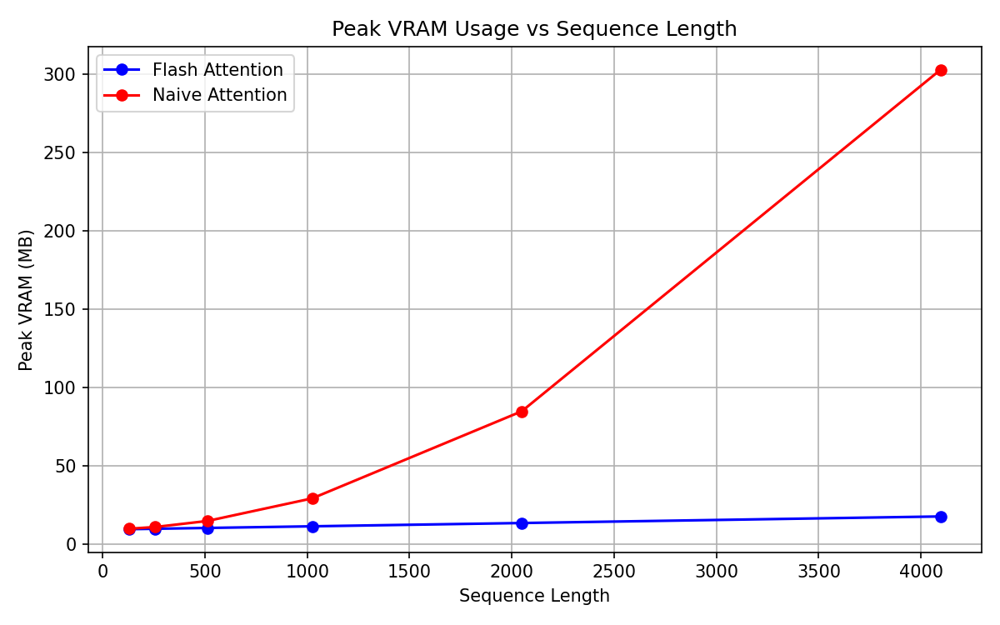
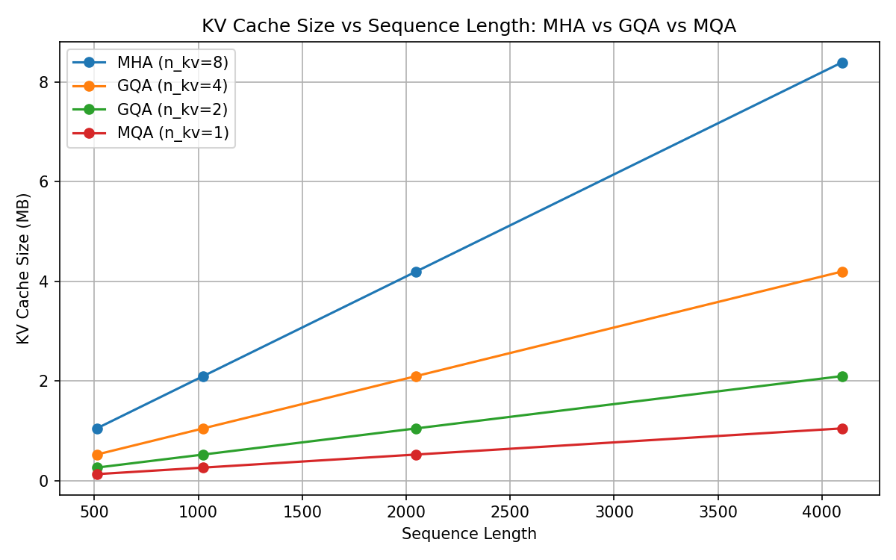
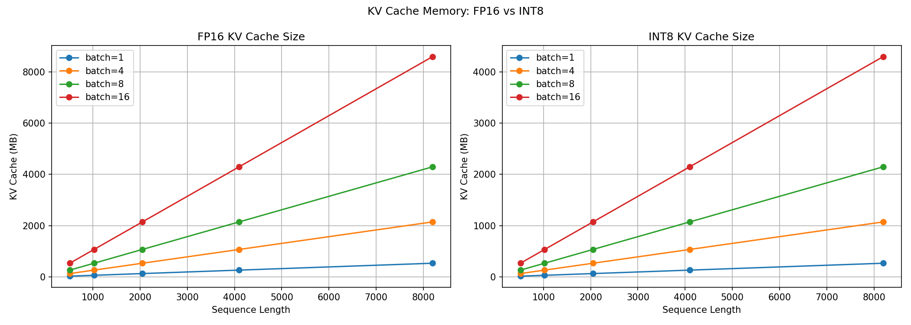
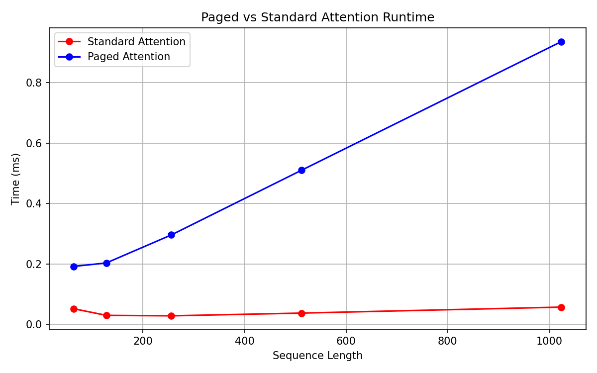
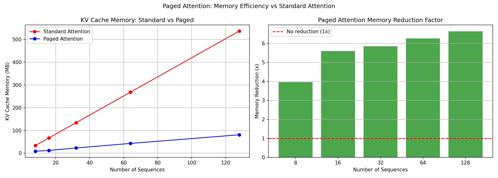
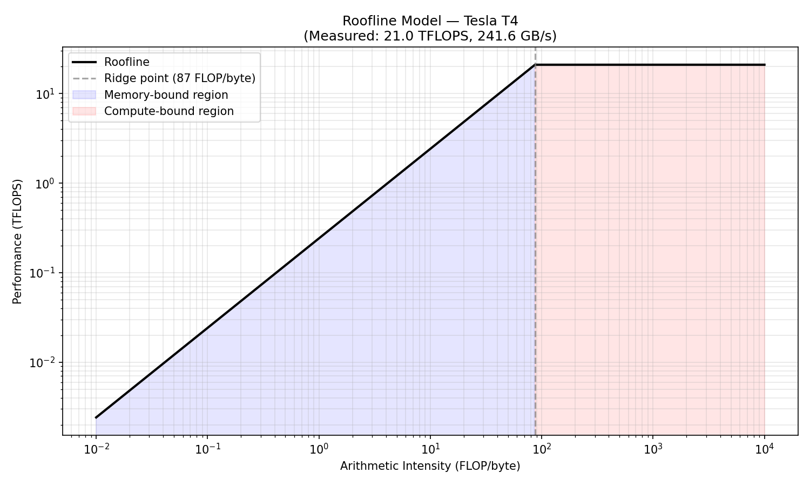
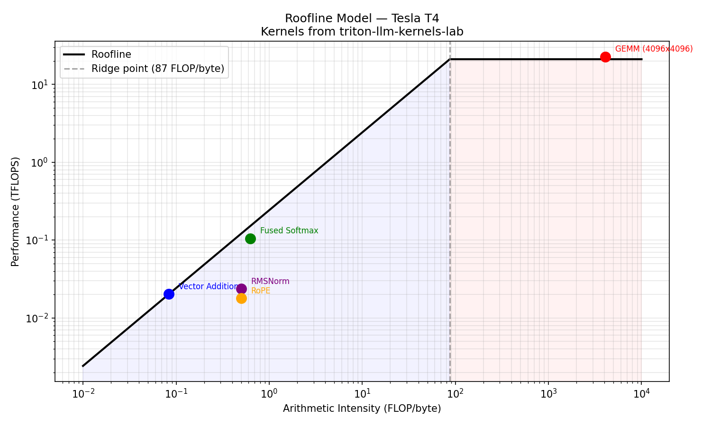

# triton-llm-kernels-lab

A hands-on lab implementing LLM inference kernels from scratch using Triton. Covers fused attention, Flash Attention, GQA, RoPE, INT8 quantization, KV cache optimization, and paged attention — with benchmarks against PyTorch baselines on real GPU hardware.

> **Hardware:** NVIDIA Tesla T4 / L4 (Google Colab)
> **Framework:** [OpenAI Triton](https://github.com/openai/triton), PyTorch
> **Model:** Meta Llama 3.2 1B

---

## Motivation

Modern LLM inference is bottlenecked by memory bandwidth, not compute. Every kernel in this repo is built to demonstrate a specific optimization that attacks this bottleneck — with measured results explaining *why* the optimization works, not just *that* it works.

---

## Notebooks

| # | Notebook | Topic | GPU | Colab |
|---|---|---|---|---|
| 01 | Triton Fundamentals | Vector Addition, Fused Softmax, Tiled GEMM | T4 | [](https://colab.research.google.com/github/susmitsingh01/triton-llm-kernels-lab/blob/main/triton-lab-notebook-1.ipynb) |
| 02 | Flash Attention | Naive vs Flash Attention, VRAM, OOM benchmark | T4 | [](https://colab.research.google.com/github/susmitsingh01/triton-llm-kernels-lab/blob/main/triton-lab-notebook-2.ipynb) |
| 03 | Transformer Blocks | Fused RMSNorm, RoPE, GQA | T4 | [](https://colab.research.google.com/github/susmitsingh01/triton-llm-kernels-lab/blob/main/triton-lab-notebook-3.ipynb) |
| 04 | Quantization | INT8 weight quant, KV cache quant, perplexity | L4 | [](https://colab.research.google.com/github/susmitsingh01/triton-llm-kernels-lab/blob/main/triton-lab-notebook-4.ipynb) |
| 05 | Fused SwiGLU | SwiGLU activation fusion | T4 | [](https://colab.research.google.com/github/susmitsingh01/triton-llm-kernels-lab/blob/main/triton-lab-notebook-5.ipynb) |
| 06 | Paged Attention | Page table, memory pool, paged attention kernel | T4 | [](https://colab.research.google.com/github/susmitsingh01/triton-llm-kernels-lab/blob/main/triton_lab_notebook_6.ipynb) |
| 07 | Roofline Analysis | Peak bandwidth, peak compute, kernel placement | T4 | [](https://colab.research.google.com/github/susmitsingh01/triton-llm-kernels-lab/blob/main/triton_lab_notebook_7.ipynb) |

---

## Notebook 01: Triton Fundamentals

Implements the three foundational Triton kernels. Establishes the kernel skeleton — `program_id → offsets → mask → load → compute → store` — used by every subsequent notebook.

**Vector Addition** — the simplest possible Triton kernel. Both Triton and PyTorch hit the T4 memory bandwidth ceiling (~245 GB/s) at large sizes.


**Fused Softmax** — eliminates 4 intermediate global memory round trips by computing max, exp, and normalize in registers in a single pass. Triton wins 5-7x over the unfused PyTorch baseline in the 256–2048 column range.


**Tiled GEMM** — block-level tiling reduces global memory traffic by T× (tile size). PyTorch (cuBLAS) dominates due to assembly-level tuning — the gap is implementation maturity, not algorithmic.


---

## Notebook 02: Flash Attention

Implements Flash Attention using online softmax — processes attention in KV tiles, keeping the attention matrix in registers and never writing the N×N matrix to global memory.

**VRAM Usage** — Flash Attention uses 17× less memory at seq_len=4096. Naive attention grows quadratically (O(N²)), Flash Attention grows linearly (O(N)).



**Max Sequence Length Before OOM** — on a 15.6 GB T4, naive attention OOMs at seq_len=12800. Flash Attention handles seq_len=32768 with room to spare — 2.6× longer sequences on identical hardware.

| Implementation | Max Sequence Length |
|---|---|
| Naive Attention | 12,288 |
| Flash Attention | 32,768 |

---

## Notebook 03: Transformer Building Blocks

Implements three core transformer operations as fused Triton kernels.

**Fused RMSNorm** — computes RMS and normalizes in a single pass. 10× faster than the unfused PyTorch baseline by eliminating 4 intermediate global memory round trips.


**Fused RoPE** — applies rotary position embeddings in registers. 5-7× faster than PyTorch across all token counts.


**Grouped Query Attention (GQA)** — shares KV heads across query head groups. The kernel change is one integer divide: `kv_head_id = head_id // group_size`. KV cache size scales exactly linearly with n_kv_heads — halving KV heads halves memory at every sequence length.



---

## Notebook 04: Quantization

Implements INT8 weight quantization and INT8 KV cache quantization kernels. Measures memory reduction and perplexity impact on Llama 3.2 1B.

**KV Cache Memory** — INT8 KV cache gives exactly 2× memory reduction at every batch size and sequence length. At batch=16, seq_len=8192 this saves 4.3 GB of VRAM.



**Perplexity Impact on Llama 3.2 1B (WikiText-2):**

| Configuration | Perplexity |
|---|---|
| FP16 Baseline | 9.25 |
| INT8 Weight Quantization | 9.27 |
| Perplexity Increase | +0.02 |

0.02 perplexity increase is negligible — imperceptible in real usage. 2× memory reduction at essentially zero quality cost.

---

## Notebook 05: Fused SwiGLU

Implements SwiGLU — the activation function used in Llama, Mistral, and Gemma feedforward blocks. The fused kernel applies silu×gate in registers without writing intermediates to global memory.


**Key finding:** The elementwise fusion benefit is small because GEMM dominates SwiGLU runtime (~95% of total time). True SwiGLU fusion requires fusing the GEMM epilogue with the activation — the approach used in production (FlashAttention, xformers).

---

## Notebook 06: Paged Attention

Implements paged attention from scratch — the memory management system that powers vLLM. Splits KV cache into fixed-size physical pages allocated on demand via a page table.

**Runtime** — page table indirection adds overhead vs contiguous standard attention. Production implementations (vLLM) load entire pages as tiles using tl.dot, closing this gap.



**Memory Efficiency** — with realistic variable-length requests (avg 320-510 tokens, max_seq_len=2048), paged attention uses 4-6.5× less KV cache memory than standard attention.



| Batch Size | Standard KV Cache | Paged KV Cache | Reduction |
|---|---|---|---|
| 8 | 33.6 MB | 8.5 MB | 4.0× |
| 16 | 67.1 MB | 12.0 MB | 5.6× |
| 32 | 134.2 MB | 22.9 MB | 5.9× |
| 64 | 268.4 MB | 42.8 MB | 6.3× |

---

## Notebook 07: Roofline Analysis

Builds the roofline model for the T4 GPU using measured (not theoretical) hardware limits, then places every kernel from this repo on the roofline.

**Measured T4 Hardware Limits:**

| Metric | Theoretical | Measured | Achieved |
|---|---|---|---|
| Memory Bandwidth | ~300 GB/s | 241.6 GB/s | 80.5% |
| Peak Compute (FP16) | ~65 TFLOPS | 21.0 TFLOPS | 32.3% |
| Ridge Point | — | 87 FLOP/byte | — |



**Kernels placed on the roofline — every kernel lands exactly where predicted:**



| Kernel | Arithmetic Intensity | Regime |
|---|---|---|
| Vector Addition | 0.08 FLOP/byte | Memory-bound |
| RMSNorm | 0.50 FLOP/byte | Memory-bound |
| RoPE | 0.50 FLOP/byte | Memory-bound |
| Fused Softmax | 0.62 FLOP/byte | Memory-bound |
| GEMM (4096×4096) | 4096 FLOP/byte | Compute-bound |

Ridge point at 87 FLOP/byte separates the two regimes. Memory-bound kernels benefit from fusion (Notebooks 01, 03). Compute-bound kernels require Tensor Core utilization and tiling (Notebook 01 GEMM).

---

## Key Concepts

- **Roofline model:** arithmetic intensity determines whether a kernel is memory-bound or compute-bound
- **Memory coalescing:** sequential thread access = full bandwidth, strided = penalty
- **Kernel fusion:** eliminate intermediate global memory writes between operations
- **Online softmax:** process attention in chunks without materializing the N×N matrix
- **Paged Attention:** on-demand KV cache allocation to eliminate memory fragmentation
- **GQA:** `kv_head_id = head_id // group_size` — one integer divide, 4× KV cache reduction

---

## Setup

```bash
pip install torch triton transformers datasets
```

Each notebook is self-contained and runs on Google Colab. Notebooks 01-03, 05-07 run on T4. Notebook 04 requires L4 for Llama 3.2 1B.

---

## References

- [Triton: An Intermediate Language and Compiler for Tiled Neural Network Computations](https://www.eecs.harvard.edu/~htk/publication/2019-mapl-tillet-kung-cox.pdf)
- [FlashAttention: Fast and Memory-Efficient Exact Attention with IO-Awareness](https://arxiv.org/abs/2205.14135)
- [Efficient Memory Management for Large Language Model Serving with PagedAttention](https://arxiv.org/abs/2309.06180)
- [Fast Inference from Transformers via Speculative Decoding](https://arxiv.org/abs/2211.17192)
- [GQA: Training Generalized Multi-Query Transformer Models from Multi-Head Checkpoints](https://arxiv.org/abs/2305.13245)
- [SmoothQuant: Accurate and Efficient Post-Training Quantization for LLMs](https://arxiv.org/abs/2211.10438)
